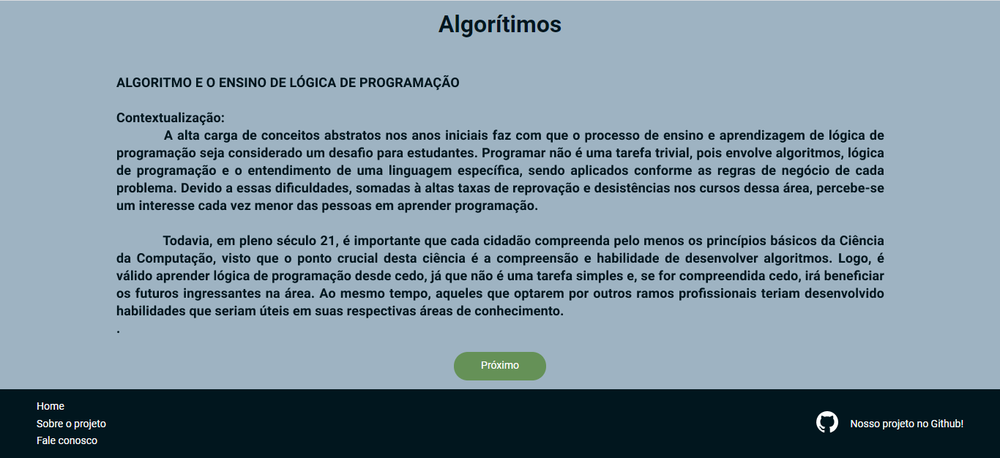
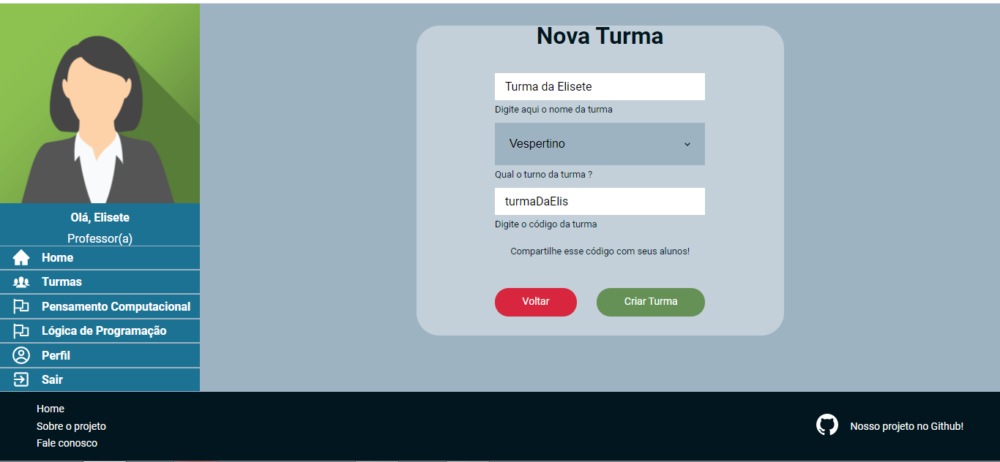

# Code Wings
1. [Apresentação - Dando asas para o aprendizado](#apresentação-dando-asas-para-o-aprendizado)
2. [Tecnologias Utilizadas](#tecnologias-utilizadas)
3. [Hospedagem da aplicação](#hospedagem-da-aplicação)
4. [Materiais Produzidos](#materiais-produzidos)
5. [Como utilizar a aplicação](#como-utilizar-a-aplicação)
6. [Árvore de Arquivos](#árvore-de-arquivos)
7. [Instalação Front-end](#instalação-front-end)
8. [Equipe](#equipe)

## Apresentação - Dando asas para o aprendizado

Este projeto é resultado do Trabalho de Conclusão de Curso do Curso Técnico em Desenvolvimento de Sistemas, SENAI Bahia - 2021.1. Com ele, buscamos resolver as seguintes problemáticas:
* Falta de entendimento do Pensamento Computacional; 
* Falta de materiais similares na língua portuguesa que abordem a gamificação do ensino de Pensamento Computacional e Lógica de Programação; 
* Material de apoio para pessoas que estão iniciando seus estudos na área de Computação; 
* Diminuição da evasão escolar no cursos das áreas de Computação. 

E, dessa forma, nosso projeto tem como objetivo proporcionar uma ferramenta lúdica de ensino de Pensamento Computacional e Lógica de Programação. Assim, trazemos, como benefícios futuros:
* Oferecer possibilidades de aprender a programar, de forma simples e lúdica, para que mais pessoas possam dar seus primeiros passos nos estudos na área de Computação; 
* Horizontalidade e Multidisciplinaridade, no sentido do aprendizado sem a hierarquia professor-aluno do ensino tradicional, e Multidisciplinaridade no sentido de poder aplicar os conhecimentos de Pensamento Computacional e Lógica de Programação a outras áreas do conhecimento; 
* Trabalhar habilidades de Pensamento Computacional, que são pouco desenvolvidas nos cursos da área de Computação e ensino básico; 
* Capacitar os aprendizes nas habilidades de Pensamento Computacional e Lógica de Programação.

Assim, nasce o Code Wings, uma aplicação para Web de ensino de Pensamento Computacional e Lògica de Programação, voltada para: docentes na área de Ciências da Computação; estudantes e entusistas da área de Ciências da Computação. O nome do projeto é uma homenagem a Jeannette Wing, diretora e professora de Ciências da Computação da Universidade de Columbia, que trouxe o conceito de Pensamento Computacional, em 2006.

## Tecnologias Utilizadas

* [React.js](https://pt-br.reactjs.org/) no Front-end; 
* [Typescript](https://www.typescriptlang.org/) no Front-end; 
* [Django](https://www.djangoproject.com/) no Back-end; 
* [Python](https://www.python.org/) no Back-end; 
* [SQLite](https://www.sqlite.org/index.html); 

## Hospedagem da aplicação

* [Heroku](https://www.heroku.com/) no Back-end; 
* [Vercel](https://vercel.com/) no Front-end.

## Materiais Produzidos

* [Bussiness Model Canvas](https://drive.google.com/file/d/1Y6x7GZaOzcRk7X11v-XD9fQE_a-HQiDT/view?usp=sharing); 
* [Pitch](https://www.youtube.com/watch?v=J8WM_CfMB4M&t=33s); 
* [Protótipo no Figma](https://www.figma.com/file/lGqtayzx1r3yaHybn4daZh/Projeto-TCC?node-id=46%3A13598); 
* [Repositório Front-end](https://github.com/TCC-CIMATEC/TCC-FRONT); 
* [Repositório Back-end](https://github.com/TCC-CIMATEC/TCC-BACK).

## Como utilizar a aplicação

### Para alunas(os)


 `Nossa aplicação está disponível [neste link](COLOCAR O LINK FINAL AQUI). Na página inicial, clique no botão Começar para ter acesso à página de Login.`


 `Aqui você pode digitar seu email e senha e confirmar para ser direcionada(o) para seu espaço de aprendizado. Como ainda não temos cadastro na aplicação, vamos clicar em Cadastre-se e criar uma nova conta.`


 `Preencha os campos corretamente e clique em Cadastrar. Atenção ao preenchimento de todos os campos e em seu email cadastrado: não é permitido que sejam criadas duas contas com o mesmo email. Ao preencher o número do telefone, certifique-se de usar apenas números. E, caso deseje preencher seu cadastro como professor, não esqueça de marcar a opção correta.`


 `Pronto! Agora é só clicar OK e fazer seu login normalmente.`


 `Preencha seu email e senha corretamente e é hora de aprender!`


 `Na página inicial, você tem acesso a todo o conteúdo da nossa aplicação. Ao clicar em sua posição no ranking, você pode ver quem são os jogadores com até as cinco melhores posições, e sua colocação em relação a eles. Atenção! Em caso de empate, usamos o critério do jogador mais antigo como o primeiro lugar. No menu Turmas, você pode ingressar em uma nova turma, adicionando o código passado por sua(seu) professor(a), cadastrado na plataforma. Você também pode clicar em uma das trilhas disponíveis, que são Pensamento Computacional ou Lógica de Programação, e iniciar seus estudos! Em perfil, é permitido que você troque sua senha.`


 `Ao clicar em sua colocação, você será direcionado para o ranking geral.`

 Regras do jogo:
 - A cada resposta correta o(a) jogador(a) ganha 10 pontos; 
 - A cada resposta errada nada será contabilizado na pontuação e ele(a) poderá tentar novamente; 
 - Para avançar para um segundo módulo, é necessário que ele acerte a todas as questões do módulo anterior; 
 - É permitido ao(a) jogador(a) revisar um módulo já finalizado, mas as questões respondidas novamente não contarão mais pontos; 
 - Não é permitido pular módulos. Eles ficam bloqueados até que o(a) jogador(a) finalize o módulo anterior.


 `Para participar de uma turma, é necessário que o(a) jogador(a) digite o código da turma enviado pela(o) professora(or).`


 `Ao clicar em Minhas Turmas, na página de Turmas, o(a) jogador(a) pode visualizar todas as turmas em que está participando. Para a segunda versão, será incluída a funcionalidade de exclusão de uma turma apenas pela(o) professora(or). Assim, pode-se ter uma melhor visão do desempenho dos alunos, sem que os dados sejam perdidos, em caso de a(o) aluna(o) sair da turma sem o consentimento da(o) professora(or).`


 `Ao clicar no cartão Pensamento Computacional, você será redirecionado à trilha de Pensamento Computacional, com o módulo inicial`


 `Ao clicar no cartão Lógica de Programação, você será redirecionado à trilha de Lógica de Programação, com os módulos de estudo. Para o ensino de Lógica de Programação, optamos por, nesse momento, aplicar pseudocódigo, ao invés de uma linguagem de programação específica.`



 `Ao iniciar um módulo da trilha, o aprendizado é dividido da seguinte maneira: uma página de conteúdo e uma questão sobre aquele conteúdo passado. Desta forma, a(o) aluna(o) consegue absorver o conteúdo aos poucos e de forma mais eficiente do que se fosse passado um conteúdo extenso e depois uma lista de exercícios. Com a próxima versão, podemos também incluir uma lista maior de exercícios com a revisão de mais de um conteúdo.`


 `Ao clicar em uma das opções, você será direcionado para a página de acerto ou erro. Ao acertar uma questão, você ganhará 10 pontos e subirá um nível.`


 `Na página do perfil, é permitido que a pessoa possa trocar a sua senha atual.`

### Para Professoras(es)

O cadastro de professoras(es) segue o mesmo para alunas(os), com a diferença que deve-se marcar a opção `Professor` . A página inicial é parecida com a do aluno, exceto que as turmas criadas são exibidas em sua página inicial, com título e senha. Caso o professor não possua turmas criadas, é exibida uma mensagem de aviso. Em uma nova versão, será incluída a função de excluir turmas.




 `Basta preencher os campos corretamente e criar uma senha para compartilhar com seus alunos!`

## Árvore de Arquivos

```
├── TCC-FRONT
│   ├── node_modules
│   ├── public
│   ├── src
│   │   ├── assets
│   │   ├── components
|   │   │   ├── Button
|   │   │   ├── Card-details
|   │   │   ├── Card-horizontal
|   │   │   ├── Card-horizontal-professor
|   │   │   ├── Card-vertical
|   │   │   ├── CardButton
|   │   │   ├── Dashboard
|   │   │   ├── DashboardProfessor
|   │   │   ├── Footer
|   │   │   ├── Form
|   │   │   ├── Select
|   │   │   ├── SideMenu
|   │   │   └── SideMenuProfessor
│   │   ├── hooks
│   │   ├── pages
|   │   │   ├── Auth
|   |   │   │   ├── Cadastro
|   |   │   │   ├── Confirma-cadastro
|   |   │   │   ├── Confirma-senha
|   |   │   │   ├── Esqueci-senha
|   |   │   │   └── Login
|   │   │   ├── Dashboard
|   |   │   │   ├── Alterar-senha
|   |   │   │   ├── Aluno
|   |   │   │   ├── Confirma-questao
|   |   │   │   ├── Detalhe-aluno
|   |   │   │   ├── Errou-questao
|   |   │   │   ├── Exercício
|   |   │   │   ├── Módulos
|   |   │   │   ├── Nova-turma-aluno
|   |   │   │   ├── Nova-turma-professor
|   |   │   │   ├── Professor
|   |   │   │   ├── Ranking-aluno
|   |   │   │   ├── Ranking-professor
|   |   │   │   ├── Trilha-inicial
|   |   │   │   └── Turmas
|   │   │   └── Main
|   |   │   │   ├── Fale-conosco
|   |   │   │   ├── Home
|   |   │   │   └── Sobre
│   │   ├── Routes
│   │   ├── services
│   │   └── styles
```

## Instalação Front-end

Você pode clonar esse projeto utilizando o comando em sua Linha de Comando:

### `git clone https://github.com/TCC-CIMATEC/TCC-FRONT.git`

No diretório do projeto, primeiro instale as dependências utilizando o comando:

### `yarn`

Certifique-se de que você tem o [Yarn](https://classic.yarnpkg.com/en/docs/install/#windows-stable) instalado em seu computador. E então, basta executar o projeto com o comando

### `yarn start`

Para executar a aplicação em seu ambiente de desenvolvimento:

Abra [http://localhost:3000](http://localhost:3000) para visualizar a aplicação em seu browser.

## Equipe

* [Elisete Vidotti](https://github.com/lizvidotti91)
* [Hudson Duarte](https://github.com/huduarte)
* [João Lucas Andrade](https://github.com/Jlucas93)
* [Jorge Valois](https://github.com/JorgeValois)
* [Luiz Gonzaga](https://github.com/LuizGonzaga91)
